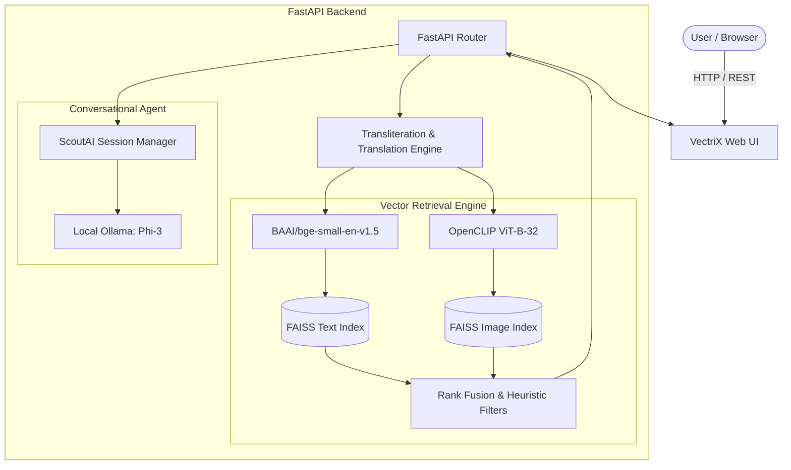

# VectriX AI ⚡
> **Next-Generation Multimodal e-Commerce Product Discovery & AI Shopping Assistant**

[](https://www.python.org/)
[](https://fastapi.tiangolo.com/)
[](https://github.com/facebookresearch/faiss)
[](https://github.com/mlfoundations/open_clip)
[](https://ollama.com/)

---

## 🌟 Overview

**VectriX AI** is a state-of-the-art e-commerce search and recommendation platform that blends **multimodal vector retrieval** with an interactive **conversational shopping assistant** (inspired by Amazon Rufus). 

By uniting **dense semantic text embeddings**, **visual feature extraction via OpenCLIP**, **FAISS vector indexing**, and **local edge LLMs (Phi-3 via Ollama)**, VectriX enables shoppers to search by text, image, voice, or multi-lingual queries (English, Hindi transliteration/Devanagari, Tamil, Telugu), and receive intelligent personalized explanations and recommendations in real time.

---

## 🚀 Key Features

- **🔍 Hybrid Multimodal Search**:
  - **Semantic Text Search**: Dense retrieval powered by `BAAI/bge-small-en-v1.5` embeddings.
  - **Visual Similarity Search**: Image query encoding via `OpenCLIP ViT-B-32`.
  - **Reciprocal Rank Fusion**: Merges image and text relevance scores for unified retrieval.
  
- **🤖 ScoutAI Conversational Assistant (Rufus-Style)**:
  - Context-aware shopping guidance linked to current search results.
  - Multi-turn conversation with isolated per-tab session memory (`SESSION_ID`).
  - Dynamic, query-aware suggestion chips generated on each turn.
  - Powered locally by **Ollama (`phi3`)** with rule-based fallback resilience.

- **🌐 Multilingual & Transliteration**:
  - Handles Hindi transliterations (e.g. *"kala shoe"* $\rightarrow$ *"black shoes"*).
  - Multi-language search support via deep translation and automated language detection.

- **🎙️ Voice Search & Filters**:
  - In-browser speech-to-text recognition.
  - Natural price limits (e.g. *"under 1000"*).
  - Sorting by price, relevance, and semantic matching.

- **🎨 Modern Interactive UI**:
  - Ambient aurora gradient background, dark/light theme toggle, 3D hover cards, product modal preview, and slide-out shopping cart.

---

## 🏗️ Architecture



---

## 📂 Project Structure

```text
vectrix-ai/
├── backend/
│   ├── app.py                 # FastAPI application and routing endpoints
│   ├── config.py              # Centralized model and index configurations
│   ├── evaluation.py          # Precision@k relevance evaluation
│   ├── image_retrieval.py     # OpenCLIP image search & hybrid rank fusion
│   ├── llm.py                # Ollama client and prompt templates
│   └── retrieval.py           # Text semantic search & price/category filters
├── data/
│   ├── processed/             # Cleaned catalog CSV and precomputed indices
│   └── raw/                   # Raw source datasets
├── frontend/
│   └── start.html             # Complete interactive UI (HTML, CSS, JS)
├── scripts/
│   ├── build_faiss_index.py           # Builds FAISS IVF index from text embeddings
│   ├── build_image_faiss.py           # Builds FAISS FlatIP index from image embeddings
│   ├── generate_image_embeddings.py   # Generates OpenCLIP embeddings for catalog images
│   └── generate_text_embeddings.py    # Generates BGE text embeddings for catalog
├── test/
│   ├── test_hybrid_search.py     # Verification script for hybrid retrieval
│   ├── test_semantic_search.py   # Verification script for text FAISS search
│   └── test_visual_similarity.py # Verification script for visual search
├── requirements.txt           # Python dependency specifications
└── README.md                  # Project documentation
```

---

## ⚙️ Installation & Setup

### 1. Prerequisites
- **Python 3.10+**
- **Ollama** installed and running:
  ```bash
  ollama run phi3
  ```

### 2. Clone the Repository
```bash
git clone https://github.com/your-username/vectrix-ai.git
cd vectrix-ai
```

### 3. Create a Virtual Environment
```bash
# Windows
python -m venv venv
venv\Scripts\activate

# macOS / Linux
python3 -m venv venv
source venv/bin/activate
```

### 4. Install Dependencies
```bash
pip install -r requirements.txt
```

---

## 🛠️ Data Pipeline & Embeddings (Optional / First Time)

If you need to generate fresh embeddings and FAISS indices from the dataset:

1. **Preprocess raw dataset**:
   ```bash
   python notebooks/preprocess_dataset.py
   ```
2. **Generate text embeddings**:
   ```bash
   python scripts/generate_text_embeddings.py
   ```
3. **Build text FAISS index**:
   ```bash
   python scripts/build_faiss_index.py
   ```
4. **Generate image embeddings & index**:
   ```bash
   python scripts/generate_image_embeddings.py
   python scripts/build_image_faiss.py
   ```

---

## 🚀 Running the Application

### 1. Start the FastAPI Backend
From the root directory:
```bash
uvicorn backend.app:app --host 127.0.0.1 --port 8000 --reload
```
API Documentation will be available at: `http://127.0.0.1:8000/docs`

### 2. Open the Frontend
Open `frontend/start.html` directly in any web browser, or serve it using a simple HTTP server:
```bash
# Optional: using python HTTP server
cd frontend
python -m http.server 3000
```
Open [http://localhost:3000/start.html](http://localhost:3000/start.html).

---

## 📡 API Reference

| Endpoint | Method | Description |
| :--- | :--- | :--- |
| `/search` | `GET` | Multimodal text search with filters, pagination, and sorting |
| `/image-search` | `POST` | Hybrid image + text search via multipart form upload |
| `/chat` | `GET` | Rufus-style shopping assistant with per-session memory |
| `/chat/clear` | `DELETE` | Clears active session history |
| `/suggestions` | `GET` | Dynamic starter search suggestions |
| `/images/{filename}`| `GET` | Static file serving for catalog product images |

---

## 🤝 Contributing
Pull requests are welcome! For major changes, please open an issue first to discuss proposed updates.

---

## 📄 License
This project is licensed under the MIT License.
